# Basic Hotel Management System

Basic Hotel Management System (in Python) is a simple console application, based on a Character User Interface. This project is used for hotel booking for individual accounts. In this CUI application we have tried to keep the language highly user friendly so that the user is properly directed through the steps of booking their hotel rooms. At the same we have also tried to maintain all the possibility which may help the user to book his/her hotel in a fast yet secured way.

## Program Features

* **USER ACCOUNTS:** This feature helps users to create theirindividual accounts so that their data is secured and bookings areeasily accessible.
* **ACCOUNT SETTINGS:** This feature helps the users to changetheir account details like username, password & email id anytimethey wish to. (Note: For changing password, the last password willalso be required for confirmation so as to prevent unauthorisedaccess to user accounts)
* **CARD VALIDITY CHECKER:** This feature allows the system tocheck the validity of a card number based on some internationallyaccepted predefined structures for credit and debit card numbers.Thus, payments are more secured.
* **INVOICE GENERATOR:** This feature provides the user with adetailed invoice at the end of every transaction. This invoice canalso be accessed later by the user through their accounts.
* **BOOKING CANCELLATION:** This feature allows the user tocancel a booking and get the refund for a booking they had donepreviously, before the booking period is over.

## Packages & Modules used

* **MYSQL.CONNECTOR:** Used for connecting **Python** (Front-end) with **MySQL** (Back-end).
* **DATETIME:** Used for calculating the date and time duration of the hotel room booking and for checking the validity of number of days.
* **SYS:** The sys module has been implemented in order to providevarious functions and variables that are used to manipulatedifferent parts of the Python runtime environment. It allowsoperating on the interpreter as it provides access to the variablesand functions that interact strongly with the interpreter.
* **CSV:** This module has been implemented for storing records ofusers’ bookings in an organised manner in a csv file that can lateron be accessed in order to check/manipulate bookings.

## Prerequisites

* Python version 3.x **(Link to download python--> https://www.python.org/downloads/)**
* MySQL Community Server 8.0 and above **(Link to download mysql community server--> https://dev.mysql.com/downloads/mysql/)**
* **Operating System:** Windows 10/8/7, Linux, MacOS
* Minimum 128MB Ram 
* Minimum 10MB of free storage
* All necessary packages & modules mentioned above under the **"Packages & Modules used"** section should be installed on the system before hosting this program

## Limitations of the Program

* Lack of Graphical User Interface.
* Mouse is non usable – only keyboard commands.
* Character User Interface often seems non intuitiveto many.
* If user forgets their password then he/she will notfffbe able to recover his/her account.
* Confidential information/text like password, credit card number, CVV are not hidden while typing.
* Software does not have any data encryption system.

## How to use the Program

**1. First fulfill all the prerequisites mentioned above under the _"Prerequisites"_ section.** 
 
**2. Then on the GitHub repository page click on the green button named _"Code"_ and then click _"Download ZIP"_. The repository will be downloaded in your system.**
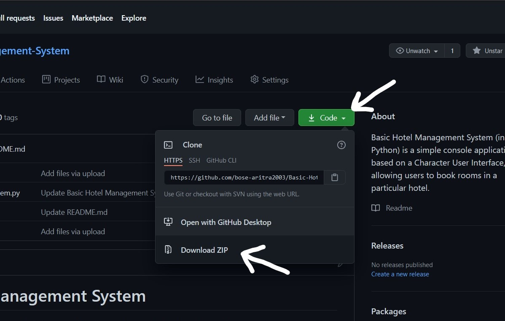 
 
**3. Now in your system, go to the folder where you have downloaded the ZIP.**
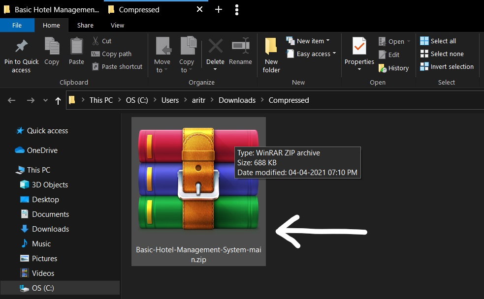 
 
**4. Now right click on the ZIP file and click on _"Extract Here"_.**
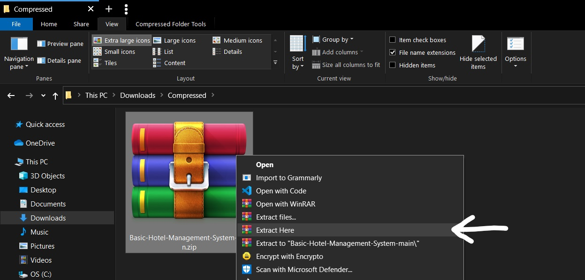 
 
**5. The ZIP will be extracted to a folder named _"Basic-Hotel-Management-System-main"_. Double click on the folder to open it.**
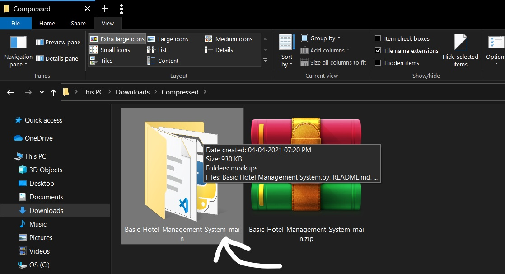 
 
**6. Now to run the program just double click on the file _"Basic Hotel Management System.py"_. And the program runs.**
 
 

## Handling MySQL password error

(While installing MySQL community server if you haven't given any password then skip this section. Otherwise follow along.) 
 
If you have set your own password while installing MySQL community server then you will face an error where the program will just keep crashing just after you follow STEP 6 mentioned above under the _"How to use the Program"_ section. The reason for this error is that while coding the program, the password for mysql connection was given as default password so when an user has their own password set then python would not be able to connect to mysql server due to password mismatch. To correct the error follow the steps given below: 
 
**1. After performing STEP 5 mentioned above under the _"How to use the Program"_ section, right click on the python file named _"Basic Hotel Management System.py"_ then move your mouse pointer over the option named _"Edit with IDLE"_. Another dropdown menu will be shown, there click on _"Edit with IDLE 3.x (32/64-bit)"_.** 
![]

## Program Mockups

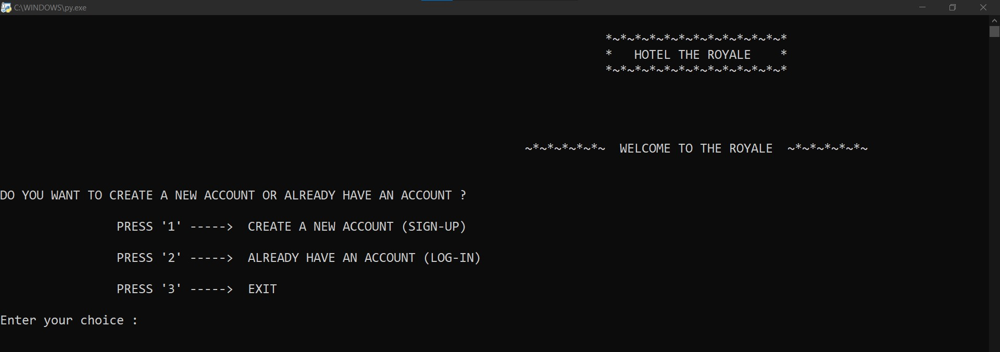
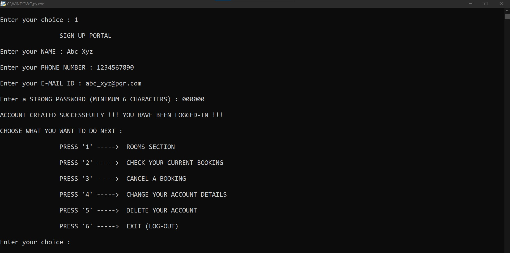
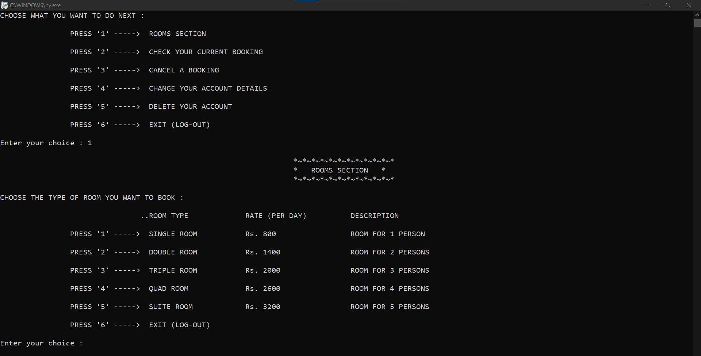
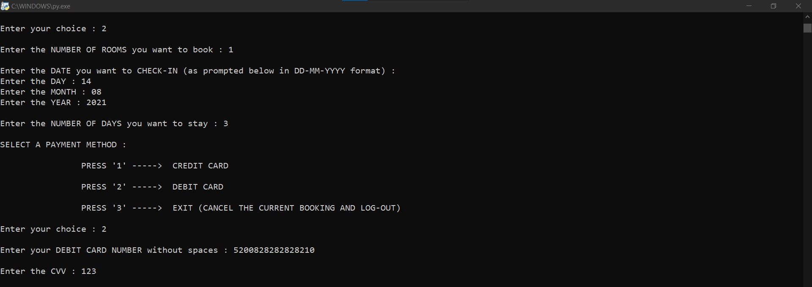
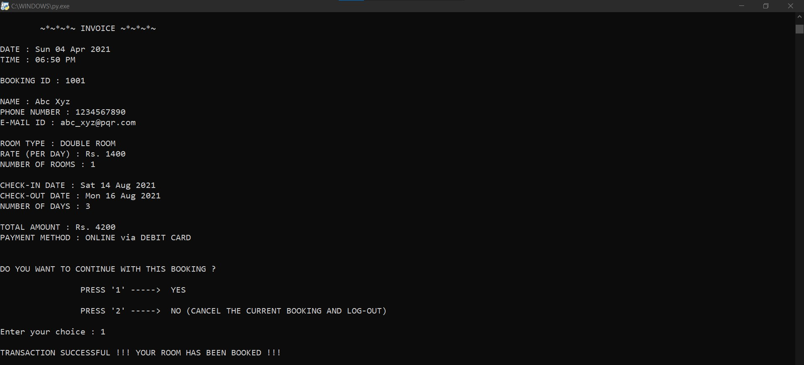
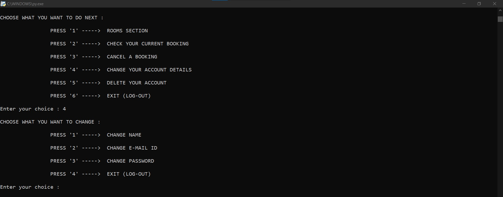
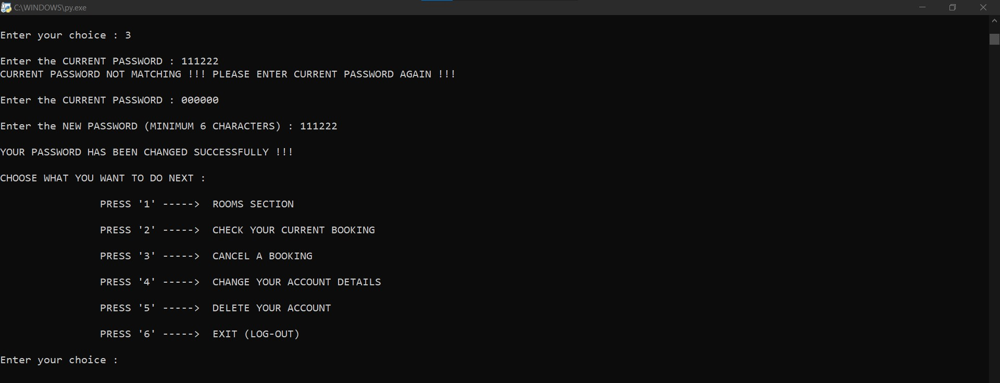

## Developers

